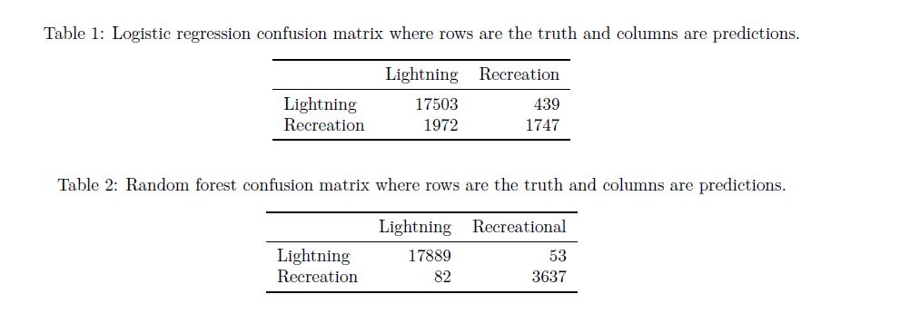
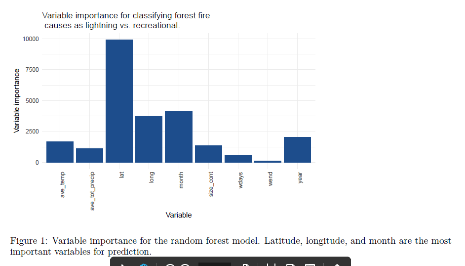
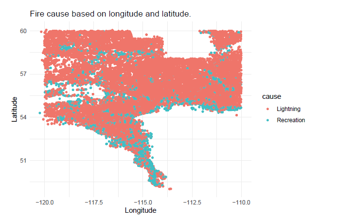

background-image: url(https://upload.wikimedia.org/wikipedia/commons/6/69/EM_Clustering_of_Old_Faithful_data.gif)

```{r setup, include=FALSE}
options(htmltools.dir.version = FALSE)
knitr::opts_chunk$set(cache=T)
library(ggplot2)
```

```{css, echo = FALSE}
# .remark-slide-content {
#   font-size: 28px;
#   padding: 20px 80px 20px 80px;
# }
# .remark-code, .remark-inline-code {
#   background: #f0f0f0;
# }
# .remark-code {
#   font-size: 24px;
# }
.huge .remark-code { /*Change made here*/
  font-size: 200% !important;
}
.tiny .remark-code { /*Change made here*/
  font-size: 70% !important;
}
```


Image credit: [Wikimedia Commons](https://upload.wikimedia.org/wikipedia/commons/6/69/EM_Clustering_of_Old_Faithful_data.gif)

- The EM algorithm at work
- Definitely not classical statistics
- Statistics, machine learning, and computer science have come together to create interesting solutions to data problems

---

# Who am I?

.pull-left[
- I work with population models that model population growth and inheritance.
- Herbicide resistance/herbicide stewardship in waterhemp
- Theoretical and empirical approaches

MS Plant Science 
- (University of Alberta, November 2016)

MS Applied Statistics 
- (University of Illinois Urbana-Champaign, August 2020)

PhD Crop Science
- not quite, but soon I hope...
]

.pull-right[

]

---

# What is statistics?

<!-- - Inverse probability (mostly a defunct definition, but I really like it) -->
<!--     - Consider a 6 sided die. If it's a fair die then we know that the probability of rolling a **1** is $\frac{1}{6}$ -->
<!--     - But what if instead I tell you that I roll a die 5 times and the results are: 1, 1, 5, 20. What's the most likely type of die that I rolled? (What's the data-generating model?) -->


- Statistics is all about learning from data
- There are two main ways to learn: Inference and Prediction
- There are *many* different ways to view statistics, but I think this is a pretty reasonable way to categorize things

.pull-left[
**Inference:** Learning about mechanisms and relationships; building and understanding the biological meaning of models
]

.pull-right[
**Prediction:** Using massive quantities of data to predict events (elections, sports, how many hamburgers to prepare ahead of a lunch rush)
]

- The boundaries between these concepts are not black and white, this is just a general guide

---

# Inference

- Classical statistics, Frequentist, Likelihood-ist, Bayesian
    - Exploratory: Graphing, finding patterns, hypothesizing
    - Confirmatory: Model building, hypothesis tests
    - This is where most Agriculture data goes.
    - These are usually parametric problems (parametric defined later)

- Examples
    - Graphs
    - Linear regression (fitting a line)
    - ANOVAs, ANCOVAs (still just linear regression but now with fancy names)
    - Generalized models (logistic regression, Poisson/beta regression)
        - Linear regression with a non-Gaussian error
    - Mixed models (some longitudinal, split plots, hierarchical designs)
    - Non-linear models (dose-response curves, anything that linear algebra can't represent)
    - Probability distributions
---

# Parametric and non-parametric statistics

**Parametric statistics** (tends to be used for inferential statistics, but not always)

- We have an idea of what the probability distributions are, or we're at least willing to make some assumptions.
- This is most statistics that we do in biology and agriculture, but there are important exceptions, especially with machine learning and prediction
- Linear and non-linear models/Mixed models/Generalized Additive models (at least the error distribution)
- Multivariate methods like PCA and Factor analysis

**Non-parametric statistics** (tends to be used for predictive statistics, but not always)

We don't know what the probability distributions are that our data represent and we are not willing to make assumptions

- Rank methods/Kernel methods/Random forest
- Machine learning methods tend to use non-parametric methods because the data sets are so large and have so many variables (features) that distributional assumptions can't easily be checked
- Machine learning methods also tend to have prediction as the goal, not inference
    - In biology we tend to want inference first

Both parametric and non-parametric methods can be used for inference, but parametric methods are more powerful (at the cost of making assumptions)
---


.pull-left[
# Inferential: Exploratory analysis

*Hypothesis generating*

- This is an approach to data analysis that focuses on non-parametric methods of interpreting data
- Non-parametric really just refers to methods that don't try to use data to estimate parameters from probability distributions or models (which we'll get to in a bit)
- We're looking for trends, relationships, and/or patterns that we might like to investigate further

- Graphing data is a major exploratory method
]

.pull-right[
**`mtcars` data**

```{r}
pairs(mtcars[,1:5])
```
]
---
# Inferential: Confirmatory analysis

*Hypothesis testing*


.pull-left[

- Confirmatory analysis is the testing or evaluation of possible hypotheses/models using data.
- These analyses are typically parametric, but not always.
- These analyses almost always try to conduct hypothesis tests (not always correctly)

$$
\begin{aligned}
H_0&: \beta_1=0\\
H_A&:\beta_1\neq0
\end{aligned}
$$

```{r}
fit <- lm(hp~cyl,mtcars)
confint(fit)
```

]

.pull-right[
```{r echo=F, message=F,warning=F,out.width="90%"}


lm_eqn <- function(df){
    m <- lm(hp ~ cyl, df);
    eq <- substitute(italic(y) == a + b %.% italic(x)*","~~italic(r)^2~"="~r2, 
         list(a = format(unname(coef(m)[1]), digits = 2),
              b = format(unname(coef(m)[2]), digits = 2),
             r2 = format(summary(m)$r.squared, digits = 3)))
    as.character(as.expression(eq));
}


ggplot(mtcars) +
 aes(x = cyl, y = hp) +
 geom_point(size = 3L, colour = "#0c4c8a") +
 geom_smooth(method="lm",se=TRUE, color="green", formula = y~x)+
 labs(x = "Number of Cylinders (cyl)", y = "Horsepower (hp)") +
 geom_text(x = 5, y = 300, label = lm_eqn(mtcars), parse = TRUE, size=5)+
 theme_minimal()
```

]

---
# Lots of other output, what does it all mean?


- There's way more output here than just the two parameter estimates for a linear function.
- We aren't dealing with functions, we're dealing with distributions

.tiny[
```{r,size='tiny'}
summary(fit)
```
]

---
class: center

# Functions vs. distributions

.pull-left[
**Functions**

No stochastic (random) component

$$
\begin{aligned}
y&=\underbrace{\beta_0 +\beta_1x}_{deterministic}\\
\\
y&=2+x
\end{aligned}
$$
```{r echo=F, warning=F, message=F, out.width="50%"}
library(ggplot2)
library(plotly)

x <- seq(1, 11, 1)
y <- 2 + x

x <- x - mean(x)
y <- y - mean(y)
df <- data.frame(x, y)

ggplot(df, aes(x, y)) +
  geom_point(size=2) +
  geom_line(size=1.5)

```


]


.pull-right[
**Distributions**

$$
\begin{aligned}
y&=\underbrace{\beta_0 +\beta_1x}_{deterministic} + \underbrace{\epsilon}_{stochastic}\\
\\
y&=2+x + \epsilon, \:\:\:\: \epsilon\sim \mathcal{N(0,25)}\\
\end{aligned}
$$
```{r echo=F, warning=F, message=F, out.width="50%"}
library(ggplot2)
library(gganimate)
library(plotly)

x <- seq(1, 11, 1)
y <- 2 + x

x <- x - mean(x)
y <- y - mean(y)

df <- data.frame(x, y)

# For every row in `df`, compute a rotated normal density centered at `y` and shifted by `x`
curves <- lapply(seq_len(NROW(df)), function(i) {
  mu <- df$y[i]
  range <- mu + c(-3, 3)
  seq <- seq(range[1], range[2], length.out = 100)
  data.frame(
    x = -1 * dnorm(seq, mean = mu) + df$x[i],
    y = seq,
    grp = i
  )
})
# Combine above densities in one data.frame
curves <- do.call(rbind, curves)


p=ggplot(df, aes(x, y)) +
  geom_point() +
  geom_line() +
  # The path draws the curve
  geom_path(data = curves, aes(group = grp))+
  # The polygon does the shading. We can use `oob_squish()` to set a range.
  geom_polygon(data = curves, aes(y = scales::oob_squish(y, c(-Inf, Inf)),group = grp))

aa=p+transition_reveal(x)
animate(aa, nframes = 48, renderer = gifski_renderer("./gganim.gif"))
```


]

---

```{r echo=F, warning=F, message=F, out.width="50%"}
x <- seq(1,100,0.1)
y <- 2 + x + rnorm(n = length(x),mean = 0,sd = 10)
library(MASS)
den3d <- kde2d(x, y)

# the new part:
library(plotly)
plot_ly(x=den3d$x, y=den3d$y, z=den3d$z) %>% add_surface()
```

---
# Simulate our own model

Let's create some linear regression data from the ground-up.
We need:

1. A functional relationship between two variables.
2. A probability distribution to describe error.
    We'll use the normal distribution to start.

$$y_i = f(x_i)$$

$$\epsilon_i \sim \mathcal{N}(0,\sigma^2)$$

The true statistical model is:

$$y_i \sim f(x_i) + \epsilon_i$$
or, for simple linear regression

$$\underbrace{y_i}_{DV} \sim \underbrace{\beta_0}_{Intercept} + \underbrace{\beta_1}_{slope}\underbrace{x_i}_{IV}+\underbrace{\epsilon_i}_{error}$$
where DV is dependent variable, and IV is independent variable.

---

## Create a functional relationship

.pull-left[
$$y_i=5+2x_i$$

```{r echo=F,message=F,results = 'hide'}
# Create a data frame of x values
# This creates a data frame object with 50 rows and 1 column (x)
# The values of x are sequential integers from 1 to 50
# I've classified these values to be stored as "numeric".
# We can perform all normal math operations on numeric data

df <- data.frame(xvar = as.numeric(1:50))

# Easy!
# Check the data frame to make sure it is what we think it is

df

# Check the data structure (is it a data frame?) and the variable classes (numeric?)
str(df)

# how do the first rows look?
head(df)

# do we have all 50 rows?
tail(df)

# Great!
# Load an R package called "Tidyverse"
# Tidyverse is a collection of R packages that work well together
# The point of these packages is to manipulate and visualize data

library(tidyverse)

# Using tidyverse, we can modify our data frame to create a new variable, just like in excel


df <- df %>% # %>% is called a piping operator, it connects these 2 lines of code
    mutate(yvar = 5 + 2*xvar) 

# mutate is the command to create a new variable
# The new variable can be based on old variables, in this case, 'x'

# Inspect the new data frame on your own.
# Are the variables sill both numeric?
# Is it still a data frame?

```

]

.pull-right[

```{r echo=F,fig.cap= "A beautiful plot, by me. This is the plot [p1]. Notice that this is not a statistical relationship, there is no error.", results = 'hide', out.width="70%"}
# Create an object called "p1" using ggplot2

p1 <- ggplot(data = df, aes(x = xvar, y = yvar)) +
    geom_point()
p1

```
]
---


## Generate and plot the error

.pull-left[
```{r}
set.seed(90210)
e <- data.frame(error = rnorm(n = 50, mean = 0, sd = 10))
```

Looks alright.
Keep this in mind whenever you check the assumption of normality for real data: it's not always pretty, but sometimes it's good enough.

]

.pull-right[
```{r echo=F}
# Notice that there are nested commands here.
# The density function acts first, and then the plot function
plot(density(e$error))
```
]


---

## Create the statistical relationship

.pull-left[
OK! 
Let's combine these components to simulate some regression data.


```{r echo=F, results = 'hide'}
set.seed(90210)
df2 <- data.frame(xvar = as.numeric(1:50),
                 e = rnorm(n = 50, mean = 0, sd = 10))

# Easy!
# Check the data frame to make sure it is what we think it is

df2

# Check the data structure (is it a data frame?) and the variable classes (numeric?)
str(df2)
head(df2)
tail(df2)

df2 <- df2 %>%
    mutate(yvar = 5 + 2*xvar + e) 
```
.tiny[
```{r}
summary(lm(yvar~xvar,df2))
```
]


]

.pull-right[

```{r echo=F,message=F, results = 'hide'}
# Create an object called "p1" using ggplot
# method = lm creates the line
# se=TRUE gives the confidence interval
# Neat?

p2 <- ggplot(data = df2, aes(x = xvar, y = yvar)) +
    geom_point()+
    geom_smooth(method=lm, se=TRUE) 
p2

```

]
---

# Ordinary least squares (OLS) vs. Maximum likelihood (ML)

We just used OLS, it's a very old technique based entirely on linear algebra.

- OLS is just linear algebra and has minimal assumptions
    - it can be done easily by hand for small data sets
    - This is what people did back in 1930
    - I think it's rarely used now, our modern models are generally too complex
- OLS produces the best linear unbiased estimates (BLUEs) as long as some assumptions are met:
    - Linear model is reasonable
    - Constant variance
    - Normality isn't technically an assumption for estimation, but it is for producing intervals
- ML is very powerful but also makes a lot of distributional assumptions about the data
    - We're looking to maximize the likelihood of seeing our data by testing many different models/parameter estimates
    - It's more like doing a grid search for the most likely parameters to have generated the data you saw
        - In fact, we can do it "by hand" like that


---


# Calculate the likelihood

We fit fancy, complex models with maximum likelihood.
But what is this mathematical voodoo?

$$\mathcal{L}(parameters|obs)=\prod_{i=1}^nf(obs_i)$$

The log-likelihood is usually used instead for numerical stability.
Products change to sums when a $\log$ function is applied.

$$\log{\mathcal{L}(parameters|obs)}=\sum_{i=1}^n \log{f(obs_i)}$$
The goal is to maximize the likelihood (or log-likelihood) to find good parameter estimates.

---

# An example with the normal distribution

.pull-left[
The log likelihood of seeing a $43$ and a $38$ when we have a normal distribution with $\mu =40$ and $\sigma^2=10$ is:
.tiny[
```{r}
x <- seq(30, 50, length.out = 100)
hx <- dnorm(x,mean = 40,sd = sqrt(10))
```
]


.tiny[
```{r}
log(dnorm(x = 43,mean = 40,sd = sqrt(10))) + log(dnorm(x = 38,mean = 40,sd = sqrt(10)))
```
]
]

.pull-right[
.tiny[
```{r , out.width="70%"}
plot(x, hx, type="l", lty=1, xlab="x value",
  ylab="Density", main="Likelihood of x=38 and x=43 when we assume a \n normal distribution with mean=40 and varaince=10")
segments(x0 = 43,y0 =0 ,x1 = 43,y1 = dnorm(x = 43,mean = 40,sd = sqrt(10)),col="green",lty=2)
segments(x0 = 38,y0 =0 ,x1 = 38,y1 = dnorm(x = 38,mean = 40,sd = sqrt(10)),col="green",lty=2)

```
]
]


---
# Let's create some non-normal data!

.pull-left[
.tiny[
```{r}
set.seed(90210)

lldata <- data.frame(xvar=as.numeric(seq(0,5,0.1)))

lldata2 <- lldata%>%
  mutate(lam=50*exp(-.9*xvar))%>%
  mutate(yvar=rpois(n = nrow(lldata), lambda = lam))
```
]

Here's our equation:

$$\lambda_i=a\cdot e^{b \cdot x}$$

$$\lambda_i=50\cdot e^{-0.9 \cdot x}$$
$$y_i \sim Poisson(\lambda_i)$$
]

.pull-right[
.tiny[
```{r, out.width="70%"}
plot1 <- ggplot(data = lldata2,aes(x=xvar,y=yvar))
plot1 <- plot1 + geom_point()
plot1 <- plot1 + 
  labs(title="Plot of present count by distance from the Christmas tree.",
       x ="Distance", y = "Presents")
plot1
```
]
]


---

.pull-left[
<!-- We'll need to estimate some reasonable starting parameters. -->
<!-- This can be a guessing game, but usually there are a few shortcuts. -->
<!-- For example, if we log transform our data and perform a linear analysis then we can get reasonable starting values. -->
<!-- Other models have similar tricks. -->
<!-- If you know what your parameters represent, then you can often make good guesses from a graph. -->

<!-- Now, remember that a model using the log-transformed values is not what we actually want. -->
<!-- We're just after starting parameter estimates, and this should get us into the right ballpark. -->

<!-- By log-transforming the observations we're trying to approximate the log-transformed response surface. -->

<!-- $$\log{y_i}=\log{a} + bx \approx \log{\hat{y_i}}=\log{a} +bx$$ -->
<!-- These equations ARE NOT equal, but maybe we can get good estimates of the parameters. -->
<!-- Notice that we have $\log{a}$, not $a$. -->

```{r echo=F, results=F}
llfit <- lm(log(yvar+0.01)~xvar,data=lldata2)
summary(llfit)
```


```{r echo=F}
# Vector of possible 'a' values
a_range <- seq(from = 57-20, to = 57+20, by=.1)

# Vector of possible 'b' values
b_range <- seq(from = -1.1-.5, to = -1.1+.5, by = 0.01)
```


```{r echo=F}
# Create all possible combinations of 'a' and 'b'
search_grid <- expand.grid(a_range,b_range)
```


```{r echo=F}
# Create an empty data frame for the loop
ll_data <- data.frame(ll=as.numeric())

for(j in 1:nrow(search_grid)){
  
  for(i in 1:nrow(lldata2)){
    # Create a lambda value based on observed x and 
      # assumed values for 'a' and 'b'
    lam_test <- search_grid[j,1]*exp(search_grid[j,2]*lldata2[i,1])
    
    # Calculate the likelihood of seeing the value of 'y' 
      # we actually saw given lambda
    log_lik <- log(dpois(x = lldata2[i,3],lambda = lam_test))
    
    # Store a single log likelihood value
    ll_data[i, 1] <- log_lik
  }
  # Sum all the log-likelihoods for a particular
    # Combination of 'a' and 'b'
  search_grid[j,3] <- sum(ll_data$ll)

}
names(search_grid) <- c("a", "b", "loglik")
```


```{r echo=F, out.width="90%"}
ll_contour <- ggplot(data = search_grid, aes(x=a, y=b, z=loglik)) + 
     geom_raster(data=search_grid, aes(fill=loglik), show.legend = TRUE) +
     scale_fill_gradient(limits=range(search_grid$loglik), high = 'blue', low = 'yellow') + 
     geom_contour(aes(colour = ..level..)) +
     scale_colour_gradient(guide = 'none')
ll_contour <- ll_contour+
  scale_x_continuous(breaks = seq(min(search_grid$a), max(search_grid$a), by = 3))+
  scale_y_continuous(breaks = seq(min(search_grid$b), max(search_grid$b), by = 0.05))
ll_contour <- ll_contour+
  labs(title="Log-likelihood surface",
        x ="Parameter 'a'", y = "Parameter 'b'")

ll_contour
```
]

.pull-right[
Looks neat!
How does it compare to a real `glm()` fit?

.tiny[
```{r}
fit_test <- glm(yvar~xvar,family=poisson,data=lldata2)
coef(fit_test)
```
]

Not bad!
Looks like if we ran enough simulations that we'd probably get about the same answer.

Note that:

```{r}
exp(3.9521029)
```

]

---

# How's it look in 3D?

```{r message=F, warning=F}
plot_ly(x=search_grid$a, y=search_grid$b, z=search_grid$loglik, type="scatter3d",color = search_grid$loglik)
```

---

# Prediction example: Random forest

Before we talk about random forest, we have to know what a CART model is

## Classification and regression trees

- They are essentially decision trees
- Regression or classification
- non-parametric
- Easy to interpret
- Want to avoid overfitting, typically the number of terminal nodes is controlled by a tuning parameter $\alpha$ (just like Ridge, LASSO, and GAM)
    - Find the best $\alpha$ for the data using cross validation

- Let's just look at one

---
class: center

# `mtcars` tree `mpg~.`


```{r echo=F, message=F, warning=F}
library(tree)

fit1 <- tree(mpg~., mtcars)
fit1_cv <- cv.tree(fit1)
plot(fit1)
text(fit1)
```

---
# Bagging 

CART models are easy to interpret, but their predictions are not competitive with other machine learning methods.

Bagging is a general bootstrap resampling method that helps reduce the variance for many machine-learning methods.

To understand what's going on we should remind ourselves about the definitions of bias and variance in the a machine learning context.

---
# Bias and variance (machine learning)


- Variance: the amount of change that we see in our model estimates when we change the model training data.
    - Flexible fits tend to have higher variance

- Bias: the ability of our model to reflect real life
    - Flexible models/models with more parameters tend to have low bias

---
# This would be a low-variance, high bias model fit (probably, it's underfit)

.pull-left[
- This is an example of a low-variance model: it's so simple that we would expect the parameter estimates to remain constant over new datasets.
- It's high bias: it's too simple to adequately explain the phenomenon, it adds error by just constantly being wrong
]

.pull-right[
```{r out.width = "60%"}
fit2 <- lm(mpg~wt,mtcars)
plot(mtcars$mpg~mtcars$wt)
abline(lm(mtcars$mpg ~ mtcars$wt))
```
]

---
# This would be a high-variance model fit (probably, it's overfit)


.pull-left[
- This is an example of a high-variance model: it's so flexible that it will be very sensitive to changes in the data
- It's low bias: it's flexible enough to model the phenomenon
]

.pull-right[
```{r echo=F, out.width = "75%", warning=FALSE}
fit3 <- lm(mpg~poly(wt,raw = T,degree = 31),mtcars)

pred_int <- predict(fit3, interval = "prediction", level = .95) 
pred <- as.data.frame(cbind(pred_int,mtcars))

library(ggplot2)
plot=ggplot(data=pred,aes(x=wt,y=fit))
plot=plot+geom_line(size=1, colour="chartreuse")
plot=plot+geom_point(aes(y = mpg), colour="cyan",size=0.5)
plot=plot+geom_point(aes(y=upr),colour = "chocolate1",size=0.5)
plot=plot+geom_point(aes(y=lwr),colour = "magenta",size=0.5)
plot=plot+labs(x = "A variable!", 
               y = "Another variable!", 
               title = "Silly-order polynomial fit", 
               subtitle = "with 95% prediction intervals")
plot
```
]

---

# Back to bagging

- If we fit full trees (or just really bushy trees) our tree will have low bias and very high variance.

- The high variance makes it more or less useless for predictions.

- However, we can use bootstrap resampling and build _**lots**_ of bushy trees.
(Individual trees are low-bias, high-variance)

- Then we average the predictions of all trees to produce low-variance predictions.


**Terminology** 

Bootstrap resampling resamples the data _**with replacement**_ to create a new sample of the same size as the original sample.
We're assuming that the data are representative of the population (which we were doing anyways).


---
# Out of bag error (OOB)

Fun fact: On average, if you bootstrap resample a dataset then, on average, about $\frac{2}{3}$ of the data will be used.

This means that for each tree we'll have on average $\frac{1}{3}$ of the data going unused.

It turns out that we can use the unused data as test data (just like cross validation) and generate prediction error estimates for each tree (OOB MSE).

We could use OOB error as a way to get tuning parameters instead of using cross validation.
This is especially useful for very large data sets (cross validation can take days).

I don't think there are any major tuning parameters for bagging (but there will be for random forest)

---

# Random forest (finally)

Random forest builds on bagging by doing something that may seem strange.

To reduce correlation between trees, random forest samples a random set of predictors for each tree.

The default number is $\sqrt{p}$ for random forest, however this is a tuning parameter that can (should) be optimized.

# Example

Alberta has forest fire data online and for free available here: https://wildfire.alberta.ca/resources/historical-data/historical-wildfire-database.aspx

We can use this data to see if we can predict whether forest firest were caused by lightning or by recreation.


---
class: center

# Predictions: Regularized logistic regression vs. Random Forest





---
class: center

# Variable importance (because we can't plot hundreds of trees)



---
class: center

# Map based visualization




---
class: center
background-image: url("pictures/end.jpg")

# Discussion and questions